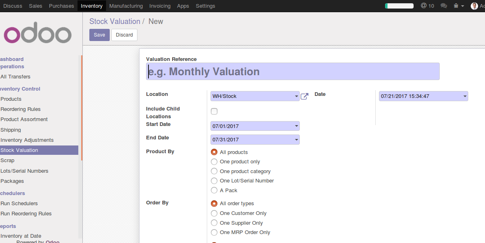

.. image:: https://img.shields.io/badge/licence-AGPL--3-blue.svg
   :target: http://www.gnu.org/licenses/agpl-3.0-standalone.html
   :alt: License: AGPL-3

=====================================================
Stock Valuation Report With Product Class and HS Code
=====================================================

'Stock Valuation Report Product Class and HS Code' allows users to generate
the report with the statistic of stock history for each stock moves, include
information about product class and hs code for each product.
This module extends export functionality with MS Excel files format regards
stock valuation reports I/O within specific period, and inherit the standard
module 'stock valuation report' to add options for product class and hs code of
product.

Usage
=====

.. image:: https://odoo-community.org/website/image/ir.attachment/5784_f2813bd/datas
   :alt: Try me on Runbot
   :target: https://runbot.my-odoo.com/runbot/63/10.0

To use this module, you need to:

#. Go to 'Inventory' module
#. Click the 'Stock Valuation' menu item on the left side of the screen

Bug Tracker
===========

Bugs are tracked on `GitHub Issues
<https://github.com/Elico-Corp/yugong-odoo/issues>`_. In case of trouble, please
check there if your issue has already been reported. If you spotted it first,
help us smash it by providing detailed and welcomed feedback.

Credits
=======

Contributors
------------

* Gu SiYuan <gu.siyuan@elico-corp.com>
* ZhouHao <zhou.hao@elico-corp.com>

Maintainer
----------

.. image:: https://www.elico-corp.com/logo.png
    :alt: Elico Corp
    :target: https://www.elico-corp.com

This module is maintained by Elico Corporation.

Elico Corp is an innovative actor in China, Hong-Kong and Singapore servicing
well known international companies and as well as local mid-sized businesses.
Since 2010, our seasoned Sino-European consultants have been providing full
range Odoo services:

* Business consultancy for Gap analysis, BPM, operational work-flows review.
* Ready-to-use ERP packages aimed at starting businesses.
* Odoo implementation for manufacturing, international trading, service industry
  and e-commerce.
* Connectors and integration with 3rd party software (Magento, Taobao, Coswin,
  Joomla, Prestashop, Tradevine etc...).
* Odoo Support services such as developments, training, maintenance and hosting.

Our headquarters are located in Shanghai with branch in Singapore servicing
customers from all over Asia Pacific.

Contact information: `Sales <contact@elico-corp.com>`__